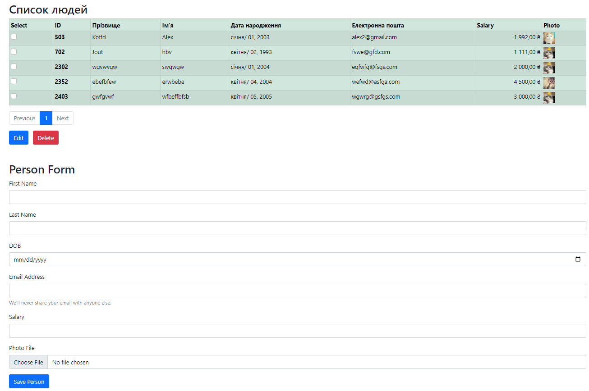
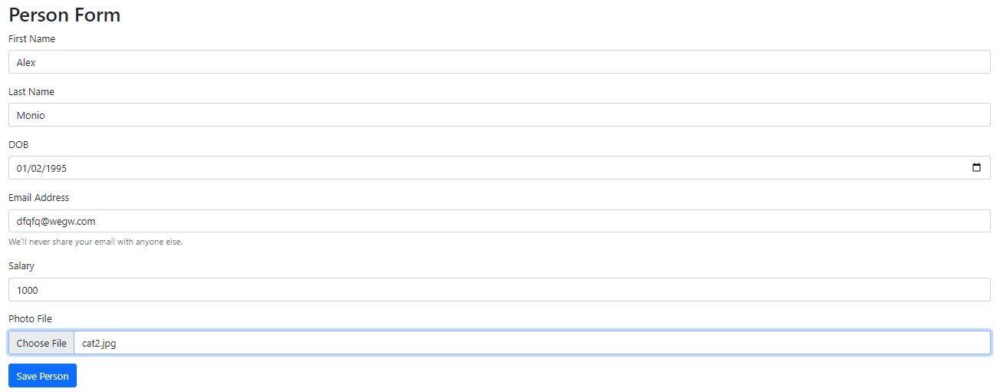
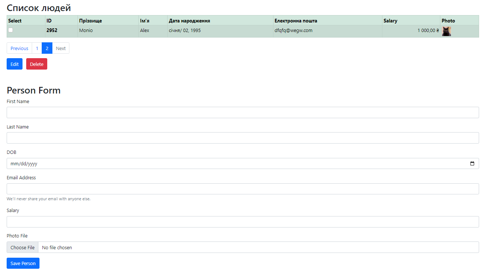
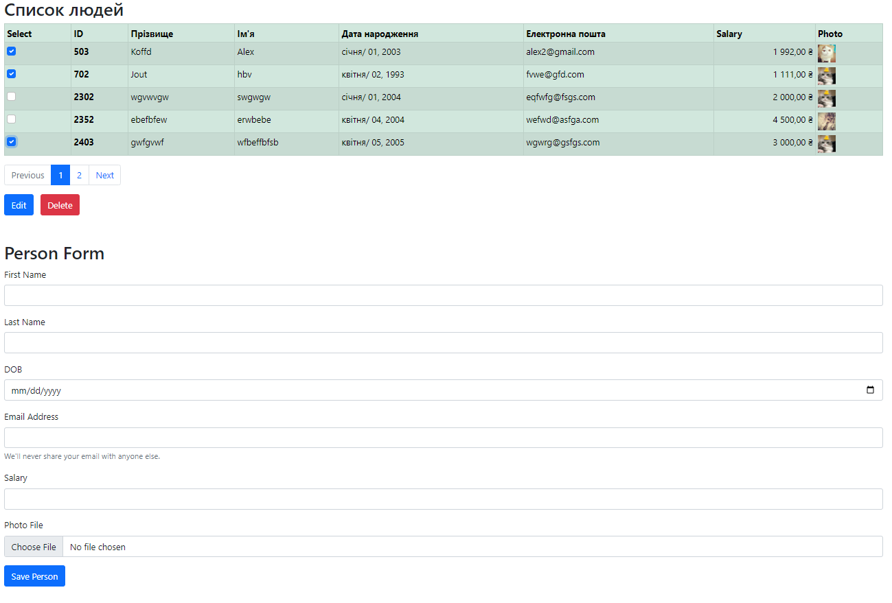
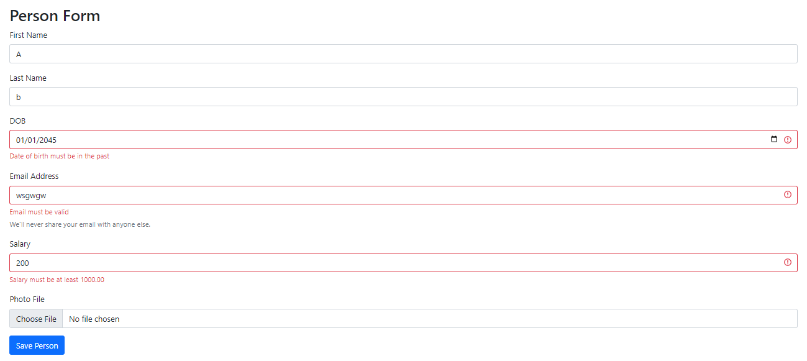

    Server-side rendered CRUD web application using Java, the Spring Framework,
    Spring Boot, Spring MVC & Spring Data JPA.
    It includes use of the H2 embedded database as well as the Bootstrap CSS framework 
    with Thymeleaf html template pages. There is a possibility of pagination, internationalization and field validation

Features of the web application:
- View a list of people
- Add new people
- Delete people
- Edit already created people

